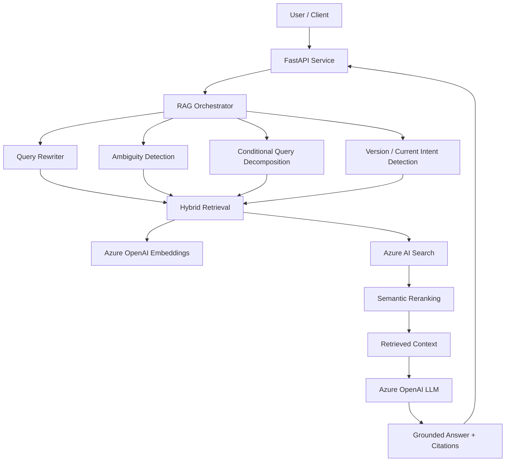

# Enterprise RAG Knowledge Assistant

A production-oriented Retrieval-Augmented Generation (RAG) system built with Microsoft Azure AI services.

The system answers enterprise knowledge-base questions across Finance, HR, IT, Legal, and Sales documents while supporting grounded citations, document versioning, ambiguous queries, multi-document retrieval, and conversational follow-up questions.

## Architecture



## Azure Services

The implementation uses:

- Azure OpenAI for embeddings and answer generation
- Azure AI Search for vector, keyword, hybrid search, semantic reranking, and metadata filtering
- FastAPI as the application service layer
- Azure App Service or Azure Container Apps as a proposed production hosting option
- Azure Application Insights / Azure Monitor for production observability
- Azure Key Vault and Managed Identity for production secrets management

## Knowledge Base

The sample enterprise knowledge base contains 11 documents across:

- Finance
- HR
- IT
- Legal
- Sales

Supported formats:

- PDF
- DOCX
- XLSX

## RAG Pipeline

### Ingestion

```text
Documents
   ↓
Document loader
   ↓
Text cleaning
   ↓
Section-aware chunking
   ↓
Metadata enrichment
   ↓
Azure OpenAI embeddings
   ↓
Azure AI Search index
```

Metadata includes:

```text
document_name
department
file_type
source_path
section
effective_year
is_current
```

Embeddings are cached locally during ingestion to avoid regenerating unchanged vectors.

### Retrieval

The baseline system used vector search only.

The improved pipeline uses:

```text
Question
   ↓
Conversation-aware query rewriting
   ↓
Ambiguity detection
   ↓
Version/current-intent detection
   ↓
Conditional query decomposition
   ↓
Hybrid keyword + vector retrieval
   ↓
Semantic reranking
   ↓
Metadata filtering
```

Query decomposition is skipped for simple questions to reduce unnecessary LLM latency.

### Generation

The answer-generation model receives only retrieved enterprise context.

Guardrails include:

- no outside knowledge
- citations to retrieved evidence
- no invented citations
- insufficient-information response when evidence is missing
- absence of information is not treated as proof that something is false
- only directly supporting sources should be cited

## Failure Scenarios Addressed

### Wrong chunk retrieval

Baseline vector retrieval sometimes returned semantically related but less relevant chunks.

Improvement:

```text
Vector search
→ Hybrid search
→ Semantic reranking
```

### Multi-section questions

Questions requiring evidence from several sections are decomposed into independent retrieval queries and results are merged.

Example:

```text
Compare the expense rules for client meals and team meals.
```

### Conflicting document versions

Pricing2025 and Pricing2026 can both be semantically relevant.

The solution adds:

```text
effective_year
is_current
```

Current-version questions are filtered to authoritative current documents.

### Missing information

Unsupported questions return:

```text
I could not find sufficient information in the knowledge base.
```

### Ambiguous questions

Example:

```text
What is the limit?
```

The assistant requests clarification instead of guessing.

### Conversational follow-ups

Example:

```text
User: Tell me about the OrbitSuite Enterprise plan.
User: What is its support level?
```

The follow-up is rewritten into a standalone retrieval query:

```text
OrbitSuite Enterprise plan support level
```

## Evaluation

A 24-question evaluation dataset covers:

```text
simple factual questions
historical/version-conflict questions
multi-section questions
no-answer questions
ambiguous questions
conversational follow-ups
```

### Retrieval Results

| Metric | Baseline | Improved |
|---|---:|---:|
| Hit@1 | 78.95% | 100.00% |
| Hit@3 | 100.00% | 100.00% |
| Hit@5 | 100.00% | 100.00% |
| MRR | 0.895 | 1.000 |
| Expected Section Hit@5 | 78.95% | 100.00% |

The largest improvement is ranking quality rather than Hit@5.

The baseline often found the correct document somewhere in the Top 5, but the improved system consistently placed the correct document first and improved section-level relevance.

### Generation Results

| Metric | Result |
|---|---:|
| Answer correctness | 2.00 / 2 |
| Groundedness | 2.00 / 2 |
| Citation correctness | 1.95 / 2 |
| No-answer accuracy | 100% |
| Hallucination rate | 0% |
| Ambiguous-query handling | 100% |
| Average latency | 15.18 sec |
| Total generation tokens | 23,915 |
| Average generation tokens/query | 996.46 |

The reported token usage currently covers final answer generation. Query rewriting, decomposition, embedding, and offline evaluation-judge calls incur additional usage.

## Latency Investigation

Stage-level instrumentation was added to the RAG pipeline.

Initial simple-query latency:

```text
Query rewrite:        ~0 sec
Query decomposition:  ~6.96 sec
Retrieval:            ~6.87 sec
Generation:           ~3.86 sec
Total:               ~17.75 sec
```

Query decomposition was unnecessary for simple factual questions.

A conditional decomposition gate was added.

After optimization:

```text
Query rewrite:        ~0 sec
Query decomposition:  ~0 sec
Retrieval:            ~6.84 sec
Generation:           ~4.23 sec
Total:               ~11.07 sec
```

This reduced the observed end-to-end latency for the test query by approximately 38%.

Further production optimization would separately profile query embedding latency and Azure AI Search latency and evaluate caching and parallel retrieval.

## API

Start the API with:

```bash
uvicorn app.api:app --reload
```

Swagger UI:

```text
http://127.0.0.1:8000/docs
```

Health check:

```text
GET /health
```

Question endpoint:

```text
POST /ask
```

Example request:

```json
{
  "question": "What is the client meal reimbursement limit?",
  "history": []
}
```

Example response contains:

```text
answer
source metadata
token usage
stage-level timings
```

## Setup

Create a virtual environment:

```bash
python -m venv .venv
```

Activate on Windows Git Bash:

```bash
source .venv/Scripts/activate
```

Install dependencies:

```bash
pip install -r requirements.txt
```

Create `.env` using `.env.example`.

Required configuration includes:

```env
AZURE_OPENAI_API_KEY=
AZURE_OPENAI_ENDPOINT=
AZURE_OPENAI_EMBEDDING_DEPLOYMENT=
AZURE_OPENAI_CHAT_DEPLOYMENT=

AZURE_SEARCH_ENDPOINT=
AZURE_SEARCH_API_KEY=
AZURE_SEARCH_INDEX_NAME=
```

## Run Evaluation

Retrieval:

```bash
python -m evaluation.evaluate_retrieval
```

Generation:

```bash
python -m evaluation.evaluate_generation
```

## Security

Secrets are not committed to Git.

Production recommendations include:

```text
Azure Key Vault
Managed Identity
Microsoft Entra ID
Private Endpoints
API authentication
document-level authorization/security trimming
least-privilege Azure RBAC
```

## Scaling Considerations

For a small corpus, one Azure AI Search index is sufficient.

At enterprise scale, the ingestion and serving layers should be decoupled.

Potential production design:

```text
Blob Storage
   ↓
Event-driven ingestion
   ↓
Functions / Container Jobs
   ↓
Parsing and chunking
   ↓
Embedding workers
   ↓
Azure AI Search
```

For very large corpora, consider partitioning strategies, incremental indexing, asynchronous ingestion, caching, rate-limit handling, and document-level ACL filtering.

## Repository Structure

```text
technical_assignment/
│
├── app/
│   ├── api.py
│   ├── rag.py
│   │
│   ├── ingestion/
│   │   ├── loader.py
│   │   ├── chunker.py
│   │   ├── embeddings.py
│   │   └── indexer.py
│   │
│   ├── retrieval/
│   │   ├── vector_search.py
│   │   ├── hybrid_search.py
│   │   ├── query_intent.py
│   │   ├── query_decomposition.py
│   │   └── query_rewriter.py
│   │
│   └── generation/
│       └── generator.py
│
├── data/
│   └── KnowledgeBase/
│
├── evaluation/
│   ├── dataset.json
│   ├── evaluate_retrieval.py
│   └── evaluate_generation.py
│
├── docs/
│   └── architecture.md
│
├── .env.example
├── .gitignore
├── requirements.txt
└── README.md
```

## Key Engineering Takeaways

The most important lesson from this implementation is that strong RAG quality does not come from embeddings alone.

Reliable enterprise RAG requires explicit handling of:

```text
document authority
version metadata
retrieval ranking
query ambiguity
multi-part questions
conversation references
missing evidence
citation quality
latency
evaluation
```

The project therefore focuses on measurable RAG behavior and production trade-offs rather than frontend polish.