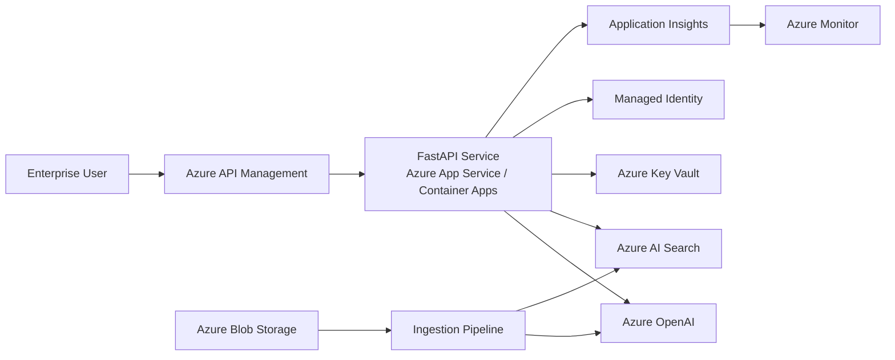

# Production Architecture

## High-Level Architecture



## Online Request Flow

```text
User
 ↓
API Management
 ↓
FastAPI
 ↓
Conversation query rewrite if required
 ↓
Ambiguity detection
 ↓
Version/current intent detection
 ↓
Conditional decomposition
 ↓
Azure OpenAI query embedding
 ↓
Azure AI Search
   ├── keyword search
   ├── vector search
   ├── metadata filtering
   └── semantic reranking
 ↓
Relevant chunks
 ↓
Azure OpenAI generation
 ↓
Grounded answer + citations
 ↓
API response
```

## Offline Ingestion Flow

```text
Enterprise documents
 ↓
Azure Blob Storage
 ↓
Ingestion worker
 ↓
PDF / DOCX / XLSX parser
 ↓
Text normalization
 ↓
Section-aware chunking
 ↓
Metadata enrichment
 ↓
Embedding generation
 ↓
Azure AI Search indexing
```

## Metadata Strategy

Each indexed chunk contains document-level and retrieval-level metadata:

```text
chunk_id
document_name
department
file_type
source_path
section
effective_year
is_current
```

Version metadata is important because semantic similarity alone cannot decide which conflicting document is authoritative.

## Security

Production credentials should not be stored in environment files deployed with the application.

Recommended design:

```text
Managed Identity
      ↓
Azure Key Vault
      ↓
Azure OpenAI / Azure AI Search
```

Microsoft Entra ID should authenticate enterprise users.

Document-level permissions should be attached to indexed chunks and enforced as Azure AI Search filters before retrieval.

For example:

```text
allowed_groups = ["finance", "executive"]
```

Retrieval would apply the user's permitted groups before returning chunks.

This prevents unauthorized content from reaching the LLM.

Private endpoints and restricted networking should be used where required by enterprise security policies.

## Observability

Every request should record:

```text
request ID
retrieval latency
embedding latency
semantic-search latency
generation latency
total latency
retrieved document IDs
retrieval scores
token usage
errors
```

Application Insights can provide distributed traces and latency percentiles.

Azure Monitor can alert on:

```text
high P95 latency
OpenAI errors
Search errors
rate limits
increased token usage
failed ingestion
```

Prompts or sensitive document content should not be logged indiscriminately.

## Scaling

### Approximately 10K documents

A single Azure AI Search index and straightforward asynchronous ingestion pipeline can generally be sufficient.

### Approximately 10M documents

The architecture would require stronger separation of ingestion and serving.

Important considerations include:

```text
asynchronous ingestion
parallel embedding workers
incremental indexing
document change detection
batch embedding
queue-based backpressure
search partition/replica sizing
metadata-based partitioning where useful
caching
rate-limit handling
dead-letter queues
```

The online query path should remain independent from bulk ingestion workloads.

## Reliability

Recommended production mechanisms include:

```text
timeouts
bounded retries with exponential backoff
circuit breaking
graceful failure messages
health/readiness endpoints
idempotent indexing
dead-letter handling
```

If Azure OpenAI generation fails after retrieval, the service should return a controlled error rather than an unhandled exception.

## Cost Optimization

Major cost drivers include:

```text
embedding generation
LLM input/output tokens
Azure AI Search capacity
repeated query rewriting/decomposition
evaluation workloads
```

Implemented optimization:

```text
embedding cache during ingestion
conditional query decomposition
```

Further optimizations:

```text
query embedding cache
response cache for safe repeated queries
smaller model for query rewriting
parallel retrieval for decomposed queries
context compression
lower top-k where evaluation supports it
```

## Latency

Stage timing showed that unnecessary query decomposition added significant latency to simple factual requests.

After introducing conditional decomposition, the observed test-query latency decreased from roughly 17.75 seconds to 11.07 seconds.

This demonstrates the production workflow:

```text
measure
 ↓
identify bottleneck
 ↓
optimize
 ↓
re-measure
```

Further optimization should distinguish Azure OpenAI embedding latency from Azure AI Search semantic-query latency.

## Deployment

Recommended production deployment:

```text
GitHub
  ↓
CI/CD
  ↓
Container image
  ↓
Azure Container Registry
  ↓
Azure Container Apps / App Service
  ↓
Application Insights
```

A production CI/CD pipeline should run:

```text
lint
unit tests
retrieval regression tests
RAG evaluation subset
container build
security scan
deployment
health verification
```